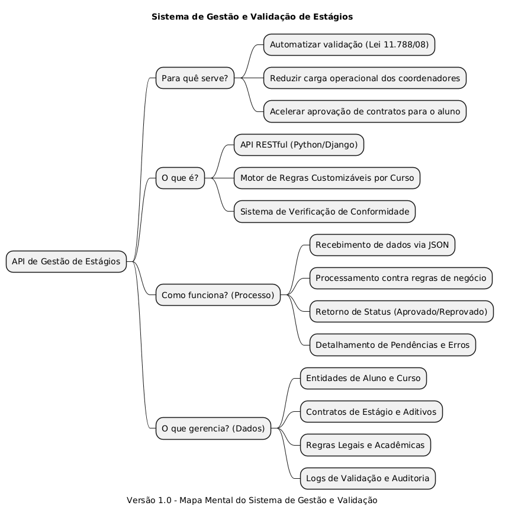

## Introdução

    O mapa mental é uma ferramenta visual utilizada para organizar e estruturar ideias de forma clara e objetiva. No contexto do Sistema de Gestão e Validação Automática de Estágios, ele permite representar os fluxos de dados, as regras de negócio e os componentes da API, facilitando a compreensão de como a automação da Lei 11.788/08 será implementada.

---

## Metodologia

A construção do mapa mental foi baseada em um brainstorm realizado pelo grupo, no qual foram discutidos os principais aspectos técnicos e funcionais da API de Gestão de Estágios. A partir dessas discussões, foi levantado um ponto importante sobre a necessidade de um motor de regras dinâmico para validar a conformidade com a Lei 11.788/08, o que direcionou a estruturação do mapa.

Foram selecionados e organizados pontos essenciais como a finalidade do sistema, as entidades de banco de dados (Django Models) e os endpoints para integração institucional. O documento foi produzido utilizando a ferramenta <b>PlantUML</b>, permitindo a estruturação hierárquica das ideias e facilitando o versionamento do diagrama junto ao código-fonte no GitHub.

---

## Mapa mental - Geral

### Versão 1.0

#### Mapa mental

---

## Conclusão

    O mapa mental desenvolvido permite visualizar a arquitetura lógica da API e como ela se propõe a resolver o gargalo administrativo do Ibmec. Ele serve como um guia para o desenvolvimento dos modelos de dados e dos serviços de validação, garantindo que todos os requisitos da Lei de Estágios e das diretrizes internas sejam contemplados no motor de regras.

---

## Referências

> BRASIL. Lei nº 11.788, de 25 de setembro de 2008. Dispõe sobre o estágio de estudantes.

> DJANGO SOFTWARE FOUNDATION. Django Documentation. Disponível em: https://docs.djangoproject.com/

---

## Versionamento

| Data | Versão | Descrição | Autor(es) |
|------|--------|-----------|----------|
| 04/04/2026 | 1.0 | Criação do mapa mental da API | João Paulo Dopcke de Vasconcellos |
